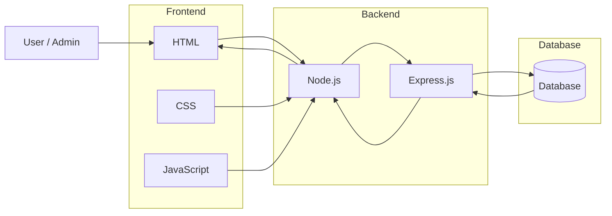
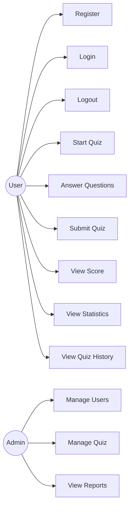

# เอกสารขอบเขตงาน (Terms of Reference: TOR)

## โครงการพัฒนาเว็บทำข้อสอบออนไลน์ (quizWeb)

---

## 1. ข้อมูลทั่วไปของโครงการ

ชื่อโครงการ: โครงการพัฒนาเว็บทำข้อสอบออนไลน์ (quizWeb)
ลักษณะโครงการ: โครงการพัฒนาเว็บเพื่อการศึกษา
เทคโนโลยีหลัก: Node.js และ Web-based Application

---

## 2. รายชื่อสมาชิกกลุ่ม

1. นางสาวแพรวปภัสสร ว่องธนากิจ 67102010524
2. นางสาวภัทรธิดา จารุจิตจำเริญ 67102010525
3. นางสาวศรุชา วิริยะจิตต์ 67102010531

---

## 3. ที่มาและความสำคัญของโครงการ

ในปัจจุบัน การเรียนการสอนออนไลน์มีบทบาทสำคัญอย่างยิ่ง โดยเฉพาะระบบการทำข้อสอบออนไลน์ที่ถูกนำมาใช้อย่างแพร่หลาย อย่างไรก็ตาม ระบบทำข้อสอบจำนวนมากยังขาดการแสดงผลการวิเคราะห์คะแนนและสถิติที่ชัดเจน เช่น คะแนนเฉลี่ย คะแนนสูงสุด และคะแนนต่ำสุด ส่งผลให้ผู้เรียนไม่สามารถประเมินผลการเรียนรู้ของตนเองได้อย่างมีประสิทธิภาพ

ดังนั้น โครงการ quizWeb จึงมีวัตถุประสงค์เพื่อพัฒนาเว็บทำข้อสอบออนไลน์ที่สามารถตรวจคำตอบ คำนวณคะแนน และวิเคราะห์ผลคะแนนในรูปแบบสถิติได้โดยอัตโนมัติ เพื่อเพิ่มประสิทธิภาพในการเรียนรู้ของผู้เรียนและลดภาระงานของผู้สอน

---

## 4. วัตถุประสงค์ของโครงการ

### 4.1 วัตถุประสงค์หลัก

* เพื่อพัฒนาเว็บทำข้อสอบออนไลน์โดยใช้ Node.js
* เพื่อสร้างระบบตรวจคำตอบและคำนวณคะแนนอัตโนมัติ
* เพื่อแสดงผลการวิเคราะห์คะแนนสอบในรูปแบบสถิติ

### 4.2 ประโยชน์ที่คาดว่าจะได้รับ

* ผู้เรียนสามารถประเมินผลการเรียนรู้ของตนเองได้อย่างชัดเจน
* ช่วยลดภาระในการตรวจข้อสอบของผู้สอน
* ผู้พัฒนาได้ฝึกทักษะการทำงานเป็นทีม การพัฒนาเว็บ และการใช้งาน GitHub

---

## 5. ขอบเขตของงาน (Scope of Work)

### 5.1 ขอบเขตงานที่ดำเนินการ (In Scope)

* ระบบทำข้อสอบแบบปรนัย (Multiple Choice)
* ระบบตรวจคำตอบอัตโนมัติ
* ระบบคำนวณและแสดงคะแนนสอบ
* ระบบแสดงสถิติพื้นฐาน ได้แก่ คะแนนเฉลี่ย (Average), คะแนนสูงสุด (Max) และคะแนนต่ำสุด (Min)
* ระบบสมัครสมาชิก เข้าสู่ระบบ และออกจากระบบ
* ระบบจัดการควิซและคำถาม

### 5.2 ขอบเขตงานที่ไม่ดำเนินการ (Out of Scope)

* ระบบชำระเงิน
* ระบบสมัครสมาชิกขั้นสูง
* ระบบสอบที่มีความซับซ้อน เช่น การสอบอัตนัย หรือการจับเวลาแบบพิเศษ

---

## 6. ความต้องการของระบบ (System Requirements)

### 6.1 Functional Requirements

* ระบบต้องให้ผู้ใช้สมัครสมาชิก เข้าสู่ระบบ และออกจากระบบได้
* ระบบต้องให้ผู้ใช้สร้าง แก้ไข และลบคำถามในควิซได้
* ระบบต้องให้ผู้ใช้ตั้งค่าควิซ บันทึกแบบร่าง และเผยแพร่ควิซได้
* ระบบต้องแสดงรายการควิซและให้ผู้ใช้เริ่มทำควิซได้
* ระบบต้องแสดงเวลาที่เหลือระหว่างทำควิซ และส่งคำตอบอัตโนมัติเมื่อหมดเวลา
* ระบบต้องคำนวณและแสดงคะแนนหลังจากผู้ใช้ส่งควิซ
* ระบบต้องแสดงประวัติการสร้างควิซและประวัติการทำควิซของผู้ใช้
* ระบบต้องให้ผู้ดูแลระบบสามารถจัดการผู้ใช้ ควิซ และดูรายงานของระบบได้

### 6.2 Non-Functional Requirements

* ระบบต้องมีความปลอดภัย โดยมีการยืนยันตัวตนและกำหนดสิทธิ์การใช้งาน
* ระบบต้องใช้งานง่ายและแสดงข้อมูลสำคัญอย่างชัดเจน
* ระบบต้องตอบสนองรวดเร็วและรองรับผู้ใช้งานหลายคนพร้อมกัน
* ระบบต้องมีความน่าเชื่อถือและไม่สูญหายของข้อมูล
* ระบบต้องสามารถขยายและปรับปรุงฟีเจอร์ในอนาคตได้

---

## 7. โครงสร้างข้อมูลที่ใช้ในระบบ (Data Structure)

* **Question**: ใช้เก็บข้อมูลคำถาม ตัวเลือกคำตอบ และคำตอบที่ถูกต้อง
* **Quiz**: ใช้เก็บข้อมูลชุดข้อสอบที่ประกอบด้วยคำถามหลายข้อ
* **Result**: ใช้เก็บข้อมูลผลลัพธ์การทำข้อสอบ เช่น คะแนน และสถิติของผู้ใช้

โครงสร้างข้อมูลดังกล่าวถูกนำมาใช้ในการตรวจคำตอบ การคำนวณคะแนน และการแสดงผลสถิติ

---

## 8. Use Case ของระบบ

**Actor หลัก:** ผู้ใช้ (User)

**Use Case หลัก:**

* เริ่มทำข้อสอบ
* ตอบคำถามในข้อสอบ
* ส่งคำตอบ
* ดูคะแนนสอบ
* ดูสถิติผลคะแนน (Average, Max, Min)

---

## 9. กระบวนการพัฒนาและเครื่องมือที่ใช้

* ใช้กระบวนการพัฒนาแบบ Agile
* ใช้ GitHub Repository สำหรับควบคุมเวอร์ชันและทำงานร่วมกันภายในทีม
* ใช้ Web Browser เป็นช่องทางหลักในการเข้าถึงระบบ
* พัฒนา Frontend หน้าเว็บไซต์
   - CSS, HTML, JavaScript (VS Code)
* พัฒนา Backend
   - JavaScript (Node.js)
   - Framework (Express.js)
  ใช้รับคำขอจากผู้ใช้, ตรวจคำตอบ, คำนวณคะแนน, ส่งผลคะแนนกลับไป
* พัฒนา Database
   - 
* ใช้ Web Browser เป็นช่องทางหลักในการเข้าถึงระบบ

---

## 10. สรุปขั้นตอนการจัดทำ Requirement

การจัดทำ Requirement ของโครงการเริ่มจากการสัมภาษณ์ผู้ใช้งานกลุ่มเป้าหมาย เพื่อรวบรวมความต้องการของระบบ จากนั้นนำข้อมูลมาวิเคราะห์และจัดทำเป็น Functional และ Non-Functional Requirements รวมถึงกำหนดขอบเขตของโครงการให้ชัดเจน โดยมีการบันทึกขั้นตอนดังกล่าวเป็นวิดีโอประกอบ

ลิงก์วิดีโอการสัมภาษณ์: https://youtu.be/3tyhzvMVRvY

---

## 11. สรุปผลการประชุม Retrospective Phase 1

ทีมงานได้มีการจัดประชุม Retrospective หลังการดำเนินงานในแต่ละช่วง โดยมีข้อสรุปดังนี้

* **สิ่งที่ทำได้ดี:** การสื่อสารภายในทีมและการแบ่งหน้าที่ชัดเจน
* **สิ่งที่ควรปรับปรุง:** การวางแผนเวลาในการพัฒนาให้รัดกุมมากขึ้น
* **แนวทางการพัฒนาในอนาคต:** ปรับปรุงกระบวนการทำงานให้มีประสิทธิภาพและลดปัญหาที่อาจเกิดขึ้นซ้ำ

ลิงก์วิดีโอ Retrospective: https://youtu.be/8sUTdzBlkeQ?si=CepGhHKbjgSgSOSg

## 12. Design Document

### 12.1 Architectural Design

### 12.2 Use Case Diagram

## 13. Figma screenshot

หน้า index ที่ยังไม่ได้ login:

หน้า index:

หน้า login:

หน้า sign in:

หน้า create_quiz:

หน้า dashboard:

หน้า history:

หน้า about:

หน้า quiz test:

## 14. กระบวนการทำงาน (Process, Methods, and Tools)

### 14.1 กระบวนการพัฒนา (Process)
ทีมใช้แนวทาง Agile Development โดยแบ่งการทำงานออกเป็นช่วงสั้น ๆ (Iteration) และมีการประชุมติดตามงานอย่างสม่ำเสมอ

🔹 การแบ่งงาน
แบ่งงานตาม Feature
แยก Frontend และ Backend
กำหนดผู้รับผิดชอบชัดเจน

### 14.2 การติดตามสถานะโครงการ (Project Tracking)
✅ วิธีการ
ใช้ GitHub Projects / Issues ในการติดตามงาน
แบ่งสถานะงานเป็น:
To Do
In Progress
Done

✅ เครื่องมือที่ใช้
GitHub Repository
GitHub Issues
GitHub Projects Board

### 14.3 ความถี่ของ Scrum Meeting
ประชุมสั้น (Scrum) สัปดาห์ละ 2 ครั้ง
แต่ละครั้งใช้เวลาประมาณ 15–30 นาที

เนื้อหาที่พูดคุย:
ทำอะไรเสร็จแล้ว
กำลังทำอะไร
มีปัญหาอะไรหรือไม่

### 14.4 การสื่อสารภายในทีม
วิธีการสื่อสาร:
พูดคุยผ่านกลุ่ม Line
นัดประชุมออนไลน์
ใช้ GitHub comment ใน Pull Request

เครื่องมือที่ใช้:
GitHub
Line
Visual Studio Code

## 15. สรุปการประชุม Retrospective Phase 2
ลิงก์วิดีโอ: 
